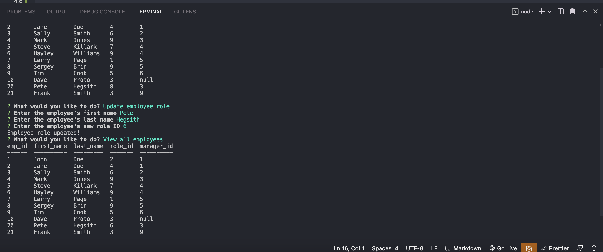

# Employee-Tracker

The purpose of this application is to allow the user to update and manage the personnel in their business.  The user can update roles of the staff using MYSQL database and view changes using console.table.

## Installation

Clone the repository in Github, the run npm install.  Load the seeds.sql and schema.sql files.  After that type npm start or node app to get the prompts to begin your inquiry.

## Functionality

The user is prompted to pick a desired option.  1. View all employees.  2. Add an employee.  3. Update an employee role. 
4. Delete an employee.  These will lead to a series of prompts so that the user can perform those actions and see the results.

## Screenshot

## Walkthrough video

https://drive.google.com/file/d/1j21KAlRHMB_81srBuXaPh7erKTdyoIbH/view

## Requirements

This application uses several node modules.  NPM install needs to be run, as well as npm install mysql, inquirer, and console-table.